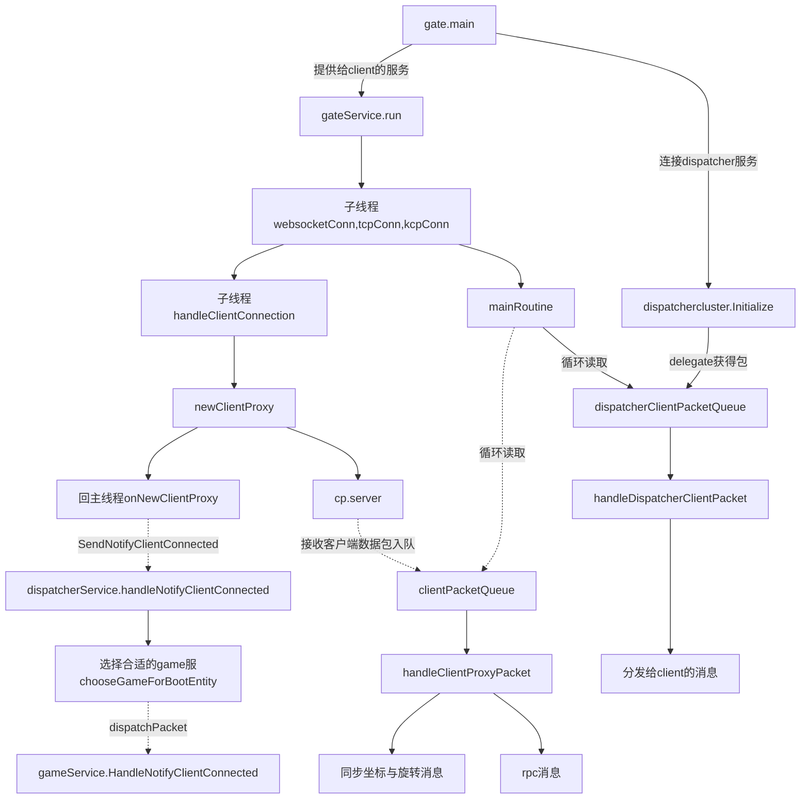

# gowolrd源码阅读

>基于entity和space的大世界游戏服务框架

## 2 属性同步

同步，分两种，属性同步和行为同步：

* 属性同步：属性分为服务端属性、客户端属性和全局属性，依赖于aoi，属性只能服务端写，客户端只读。
* 行为：entity之间通过rpc调用。为了便于管理，可以把rpc约束为一两个entity，并通过指令派发，指导game world运行。

调用指定客户单对象，通过属性过滤来实现：

//调用属性chatroom=服务端定义的chatromm的属性的客户端，入参是a.GetStr("name"), text
actor.CallFilteredClients("chatroom","=", a.GetStr("chatroom"), "OnRecvChat", a.GetStr("name"), text)
//进入新房间，就是新设置actor的chatroom属性
a.SetClientFilterProp("chatroom", name)

## 3 关键概念：

* space: 空间，类似于kb的cell概念，一个entity必须属于一个space，在实现里space也继承与entity，可以认为是服务进程里entity的跟节点。
对于space的不同定义实现不同的功能，比如space作为hall就是服务大厅，space作为match就是匹配服务，space作为game logic就是逻辑服务器。

## 4 学习流程

* -[x]:  多频道聊天
* -[x]: 登陆注册存储
* -[x]: 移动同步与aoi
* -[x]: 启动流程与热加载 
* -[ ]: gate解析
* -[ ]: dispatcher解析
* -[ ]: entity解析 

##  架构
分为三层，gate,dispatcher,game层，其中gate，dispatcher可独立运行，game层通过加载逻辑代码以插件的形式运行。

* gate：网关，client的入口

* dispatcher：所有从gate来的流量经过这里转发，目前是单点形式，考虑开发为动态可扩展，前提是不能有状态。

* game: 游戏逻辑进程，热更的机制是对运行的所有entity，存盘，并重新加载，在此过程中，指令流量先缓存在dispather里，这就是dispatcher存在的意义。等game2启动并加载成功，通知dispatcher把后续流量导入进来。

### 1.1 gate
>需要tcp,kcp,websocket,http服务

