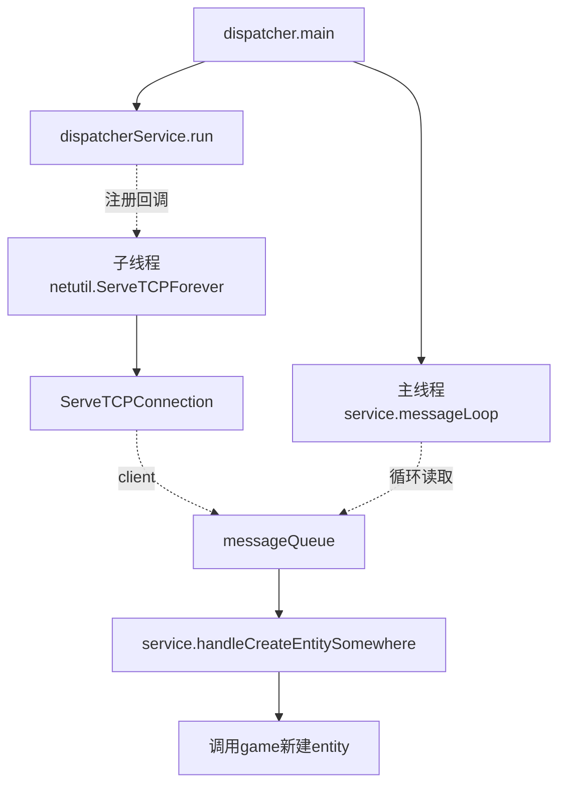

### 1.2 dispatcher
>只需要tcp服务，缓存gate列表，game列表，以及entity属于哪个gameId

```mermaid

graph TB
    a[dispatcher.main]-->b[dispatcherService.run]
    b-.注册回调.->c[子线程netutil.ServeTCPForever]
    c-->d[ServeTCPConnection]
    d-.client.->e[messageQueue]
    a-->b2[主线程service.messageLoop]
    b2-.循环读取.->e
    e-->f[service.handleCreateEntitySomewhere]
    f-->g[调用game新建entity]

```
