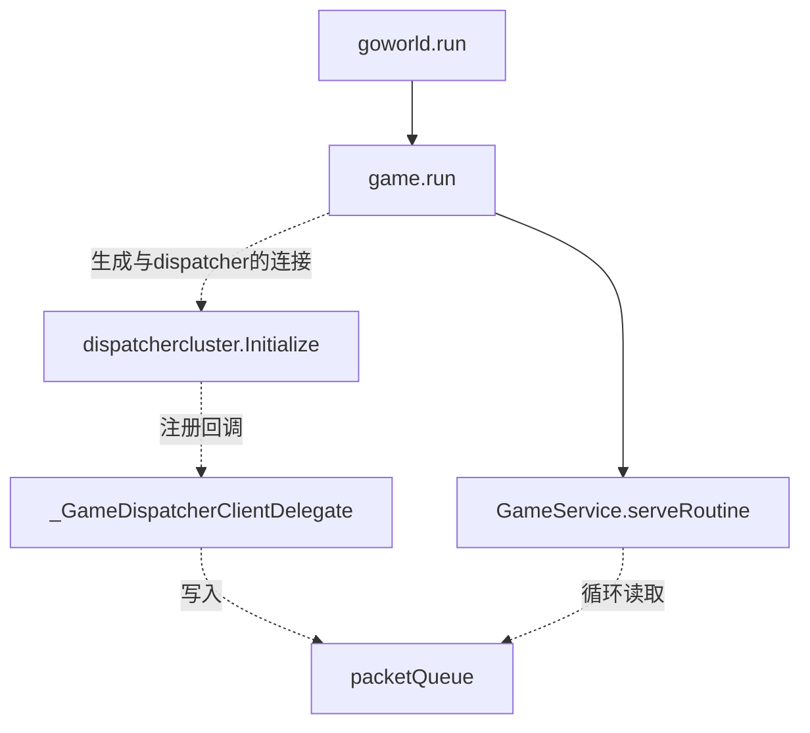
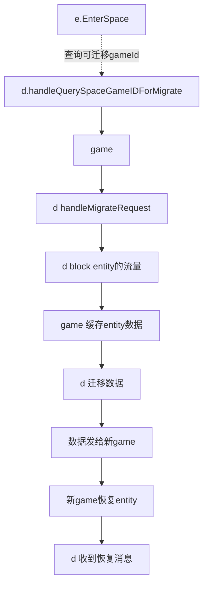

# entity图解
>实体包含了id,spaceId,属性Attr map
>dispatcher相当于路由表，查询entity或者actor，向dispatcher问询。
>因此，进一步扁平化，可以认为gate,login，lobby都是game,通过dispatcher互相通信。服务器之间的跳转，简化为场景切换的概念。
>dispatcher之间通过raft算法实现一致性，这样无论连接哪个dispatcher，都能查到entity位于哪个game

## 场景跳转 enterSpace

>e为entity缩写
>d为dispatcher缩写

## 问题

* 1属性如何单向和双向同步？

* 2 entity如何call方法传递给client
* 3 client如何call方法传递给entity