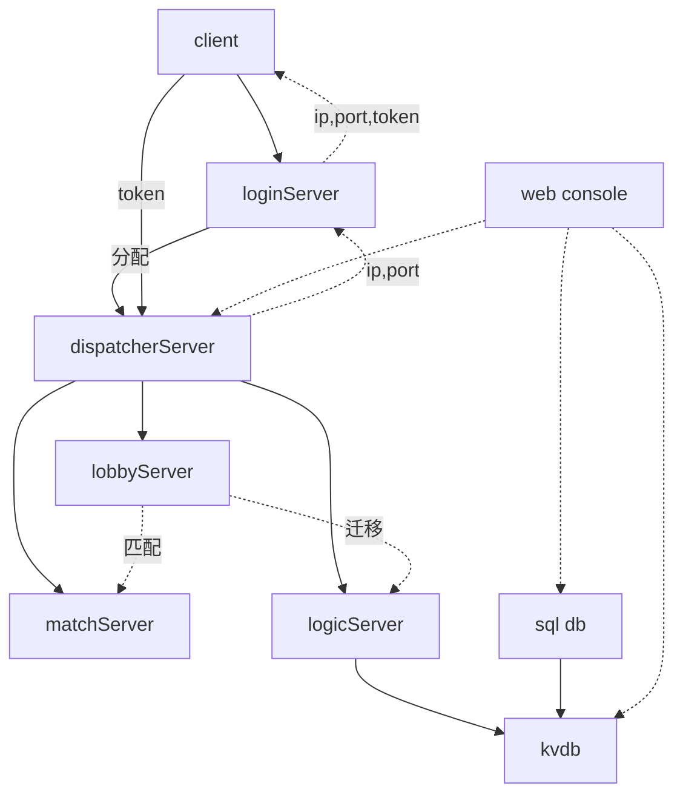
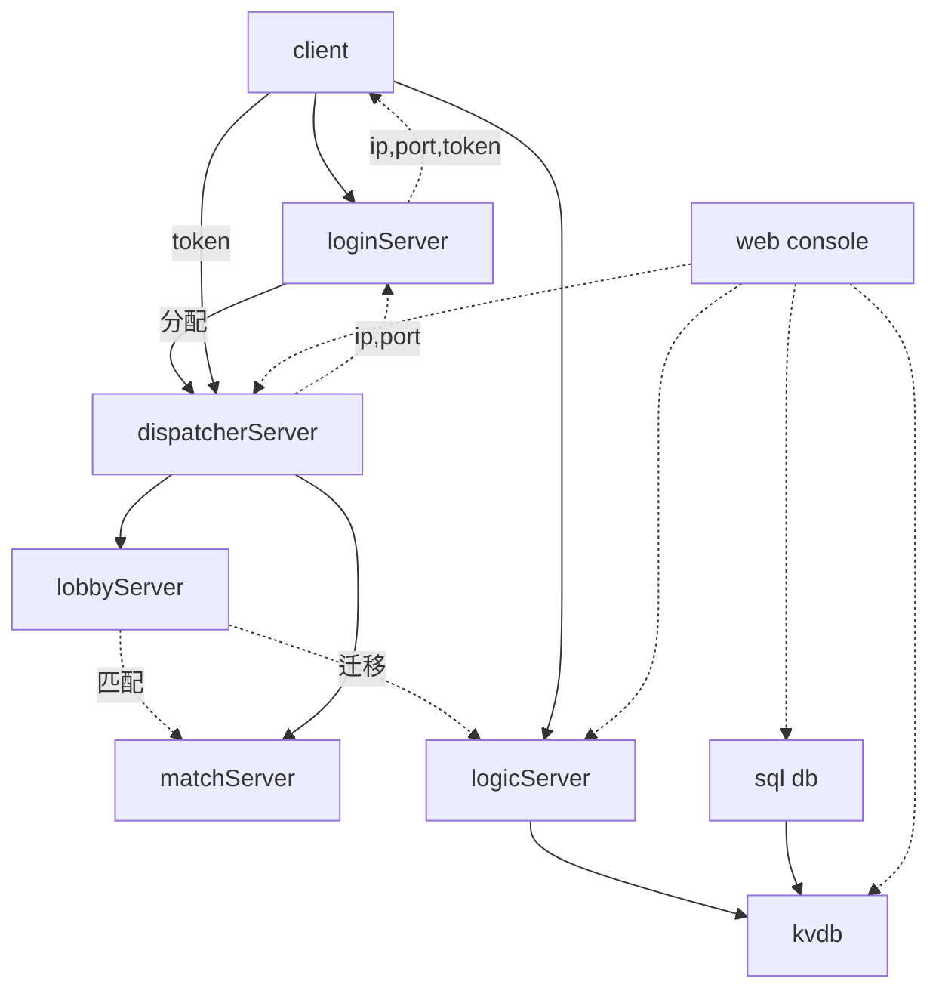
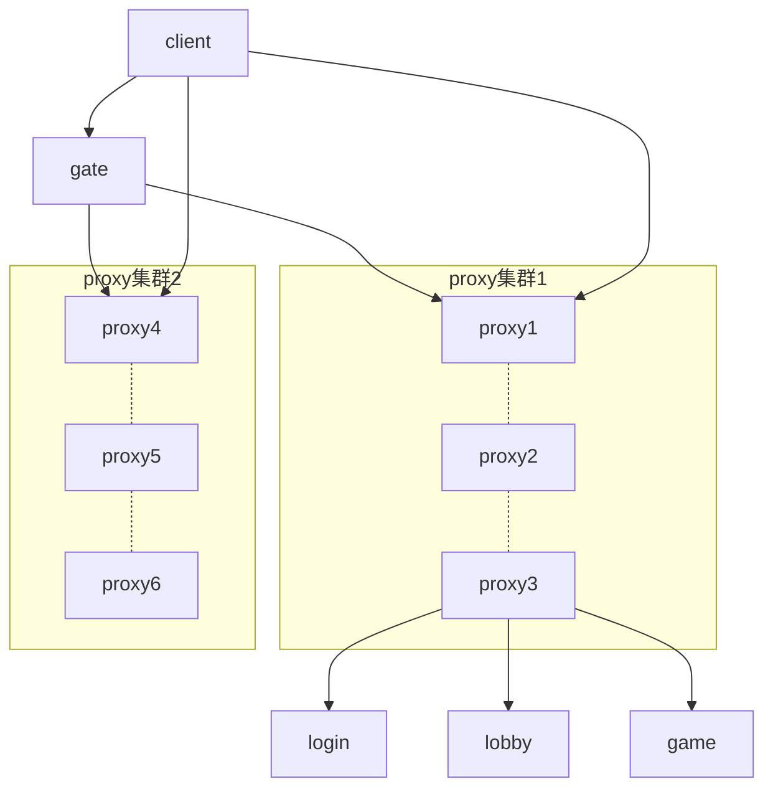

# 理想设计

### 方案1 代理方案支持任意节点的热更
>节点与节点之间通过tcp通信，节点与客户端可通过tcp,kcp,websocket通信

### 方案2 客户端与服务端直连方案
>适用于快节奏，低延迟游戏，比如fps,moba,要求同步频率15以上，至少60ms一次
>对应的webconsole也要能连接gameServer，才能知道gameServer的真实情况
>同时用户重连，先尝试重连gameServer，如果失败了重连lobbyServer,如果lobbyServer也失败，只能重连loginServer了

### 方案3 完全扁平化方案

