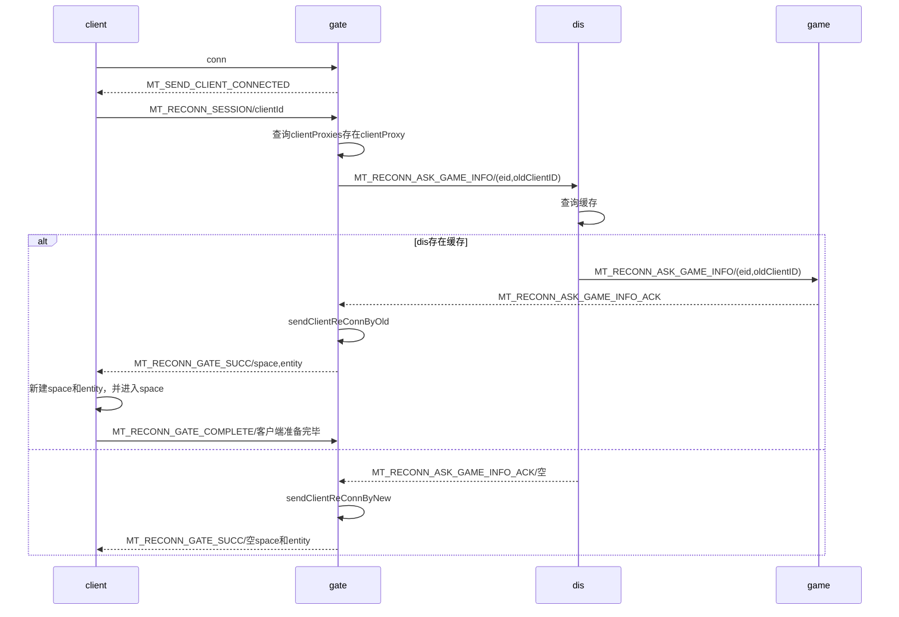

# 客户端的重连与恢复

>主要针对客户端的暂时掉线，以及客户端长时间离线的处理，不同类型的游戏，处理方式也不同。
分为主动重连，心跳离线，主动离线

## 主动重连

>client短时间断开，并快速的重连。初步的解题思路是：client存储bootEntityId和clientId，并在首次连接时，存入请求header。

>服务端收到后，在gate查询clientId缓存，如果不存在，则认为已经清理过，走标准连接流程，create boot entity -> enter nil space -> enter target space,并通知客户端新的clientId和bootEntiyId,客户端如果有缓存，则需要更新clientId 

> 服务端存在缓存，新的conn赋予clientProxy，通知客户端重连成功。客户端根据业务逻辑定制拉取缓存的策略，如果是默认策略，则gate把block的消息，一股脑推送过来。

### 1 客户端断开

旧版客户端连接：每个conn生成对应的clientId,conn赋予clientProxy,存入clientProxies。并通知dispatcher有bootEntity连接，dispatcher通知game分配entity。

当client断开时，gateService触发onClientProxyClose函数。
当收不到client断开信号时，gate有心跳检测，当超过60s收不到客户端的包，触发close，关联到onClientProxyClose函数

#### 优化方案

1. 当触发onClientProxyClose时，不直接触发删除操作，把clientProxy放入dealyClear队列，在服务器延迟60ms，到时间再删除。
2. 请求连接：
2.1  gate通知client消息MT_CALL_CLIENT_CONNECTED(26)
2.2  client收到后发送MT_RECONN_GATE_SESSION并携带clientId
2.3  gate如果这时在dealy队列，直接复用clientProxy，并告知client重连成功MT_RECONN_GATE_SUCC并携带client所属空间和实体
2.4  client收到消息后新建space和entity，新建成功后告知gate消息MT_RECONN_GATE_COMPLETE，gate告知dispatcher和game重连成功，推送后续消息，可以选择主动拉取。
2.5  gate收到后发现缓存和client都没有，走旧版本的流程，新建entity，客户端新建bootEntity。

##### 实现

### 问题

#### 1. entity在client新建isClientOwner属性？

只有需要玩家操作的entity，有isClientOwner属性
在服务端为需要SetClient的操作，isPlayer为true。
space不属于客户端。
#### 2.nilSpace在game新建时，client需要新建吗？

当entity进入space时，通知client新建该space；在client该space创建后，把所有属于该space的entity执行OnEnterSpace操作。
复盘一下：server端进入space之后，才通知client执行进入，并触发client的ownerEntity的OnEnterSpace函数，该函数完成切换场景操作。
