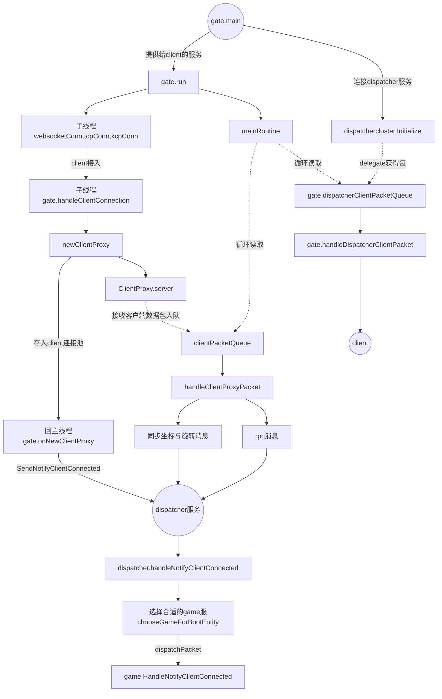

# gate解析


### 综述 gate->dispatcher->game
>需要tcp,kcp,websocket,http服务
>gateService缩写为gate
>dispatcherService缩写为dispatcher
>gamaeService缩写为game



* 收到client的位置消息，定时5ms一次性同步给所有的dispatcher。根据entity确定属于哪个dispatcher

* gate还有一个重要作用，就是与client的心跳，检测client是否掉线，dispatcher与game不处理这个。做好任务的分层治理。

* 


## 问题

 ### 1 gate是怎么找到目标dispatcher？

跟game类似，通过dispatchercluster主动连接所有dispatcher,存储连接池。

计算entityId的int值，除以dispatcher总数取余，获得dispatcher序号，一个game会连接所有的dispatcher，然后平均分配dispatcher。

也就说说并没有根据dispatcher真实的负载去选择，dispatcher就是一个简单的proxy代理。

```
func SelectByEntityID(entityid common.EntityID) *dispatcherclient.DispatcherClient {
	idx := hashEntityID(entityid) % dispatcherNum
	return dispatcherConns[idx].GetDispatcherClientForSend()
}
```

 ### 2 gate是怎么找到目标client的?

 client在接入gate时，gate会对每个连接分配一个clientProxy对象,该对象包含一个唯一的clientid，`common.GenClientID()`生成，以键值对的形式缓存gateService.clientProxies

 当收到dispatcher的包时，packet会携带clientId, 根据clientId找到ClinetProxy,proxy保持了与客户端的连接。

 收到MT_CREATE_ENTITY_ON_CLIENT消息，表示entity创建成功，entityId赋予clientproxy.ownerEntityID

 收到MT_SYNC_POSITION_YAW_ON_CLIENTS包，是批量包，需要拆解批量发送。

 收到MT_CALL_FILTERED_CLIENTS，需要过滤client，找到指定的client发送。aoi的简单使用left-lerning红黑树实现，左倾红黑树。

### 3 gate如何维护与client的心跳？


在gate，持有client连接实例的clientProxy，拥有heartbeatTime字段，每次收到新包，更新心跳时间，定期检查哪个clientProxy的心跳超时了。

心跳超时10s，10s之后关闭客户端连接。后续要不要清理，并没有看到后续的操作。

#### 4 client连接gate成功之后，什么时候创建entity？

* gate生成bootEntityID,携带clientId发给dispatcher
* dispatcher收到bootEntityID，clientId，再补上gateid发给game
* game收到HandleNotifyClientConnected通知后新建gameClient表示对客户端的影射，gameClient包含clientid，gateId。
* game使用bootEntityName和bootEntityId生成一个Entity实体，比如game的bootEntity是Account，每个clint连接成功，都会生成一个与gameClint绑定的AccountEntity,其EntityId由gate传递过来。然后分配入nilSpace。entity实体存入EntityManager的map。
* game创建entity成功后，通知gate，gate通知client，client缓存account的entityId。而这个accountEntity并不需要持久化，因为其只表示用户的登录状态，如何服务器不存在，重新生成就是了。如果存在，表明client只是暂时离线了，

#### 5 重连怎么处理？

目前的设计，每次client连接成功，都会执行onNewClientProxy，其实这没有必要。考虑拆分为两步：
1. 建立连接，生成clientProxy
2. client发送连接请求，携带entityId
3. 服务端收到后，确认gate缓存proxyClient，如果存在，说明gate与dispatcher的连接，game的entity并未销毁，则更新gate缓存为proxyClient，并继承旧proxyClient的clientId,然后销毁。

#### 6 客户端只有tcp连接，后续计算新增kcp连接,怎么做？

#### 7 对于位置同步，可以优化为相同的pos，过滤掉，不再给dispatcher发送，怎么做？