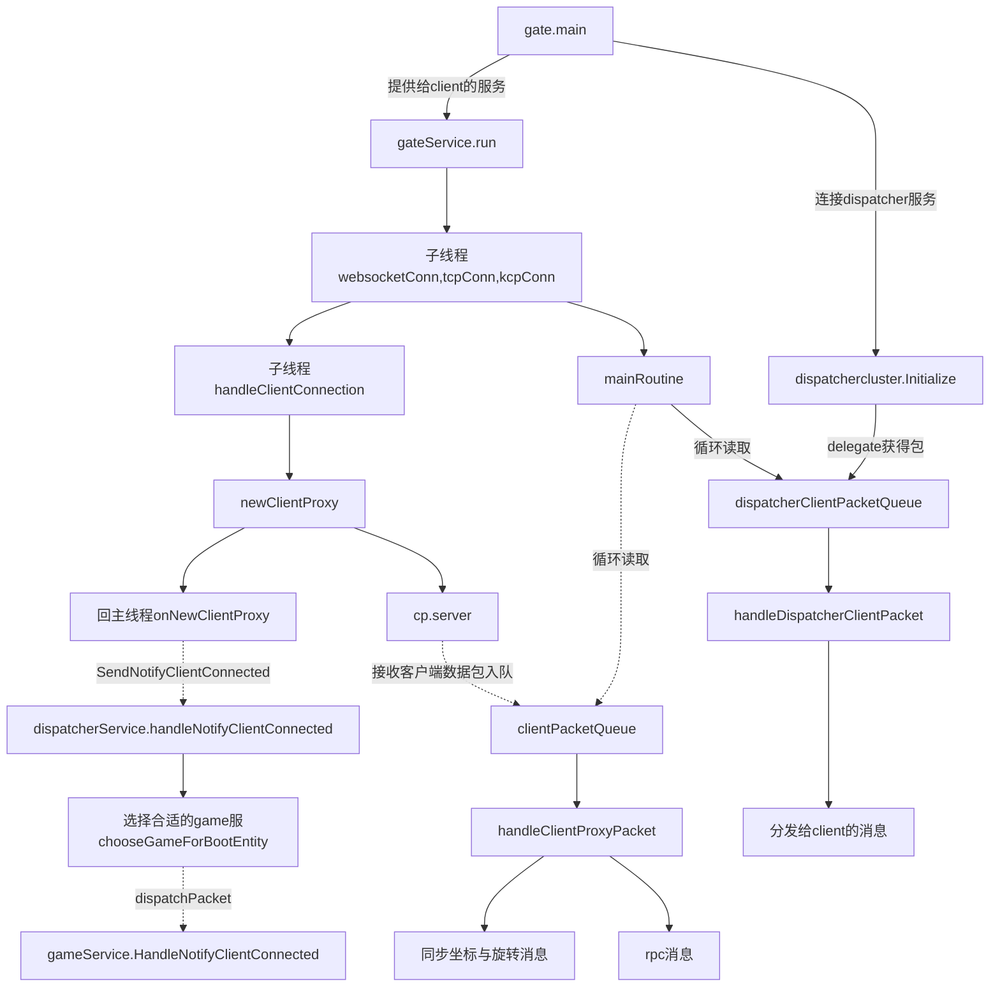

# gate解析

### 综述 gate->dispatcher->game
>需要tcp,kcp,websocket,http服务

```mermaid
graph TB
    a0[gate.main]--提供给client的服务-->a[gateService.run]
    a-->b[子线程websocketConn,tcpConn,kcpConn]
    b-->c[子线程handleClientConnection]
    c-->d[newClientProxy]
    d-->e[回主线程onNewClientProxy ]
    e-.SendNotifyClientConnected.->f[dispatcherService.handleNotifyClientConnected]
    f-->g[选择合适的game服chooseGameForBootEntity]
    g-.dispatchPacket.->h[gameService.HandleNotifyClientConnected]
    d-->i[cp.server]
    i-.接收客户端数据包入队.->j[clientPacketQueue]
    b-->k[mainRoutine]
    k-.循环读取.->j
    j-->l[handleClientProxyPacket]
    l-->l1[同步坐标与旋转消息]
    l-->l2[rpc消息]
    a0--连接dispatcher服务-->m[dispatchercluster.Initialize]
    m--delegate获得包-->n[dispatcherClientPacketQueue]
    k--循环读取-->n
    n-->o[handleDispatcherClientPacket]
    o-->p[分发给client的消息]
```
