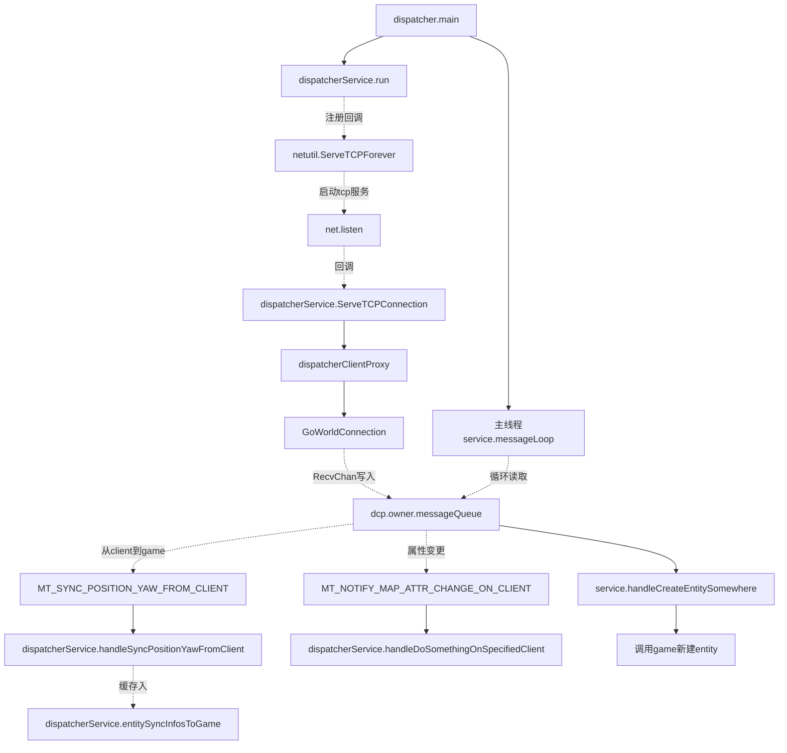

### 1.2 dispatcher
>提供tcp服务，缓存gate列表，game列表，以及entity属于哪个gameId
>server模式，提供给game和dispatcher连接

注意：

* 从client也就是gate来的消息，要做下缓存，而是不是直接退给game,方便game的热更新
* dispatcher的tick也是5ms，首先处理子线程回主线程的回调，然后发送game缓存信息。dispatcher的任务就是gate与game的代理和服务发现，因此越快越好
* 从game来的往gate去的消息，直接发送

### 问题

1. dispatcher集群之间如何通信？

考虑dispatcher使用服务发现consul，game也可以考虑，

client接入gate，由gate决策dispatcher的负载，一旦分配，就不再变更。