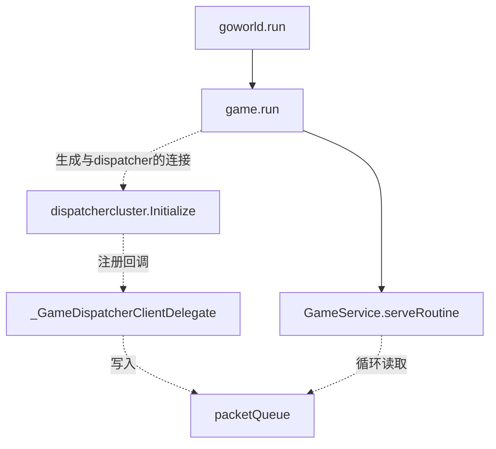
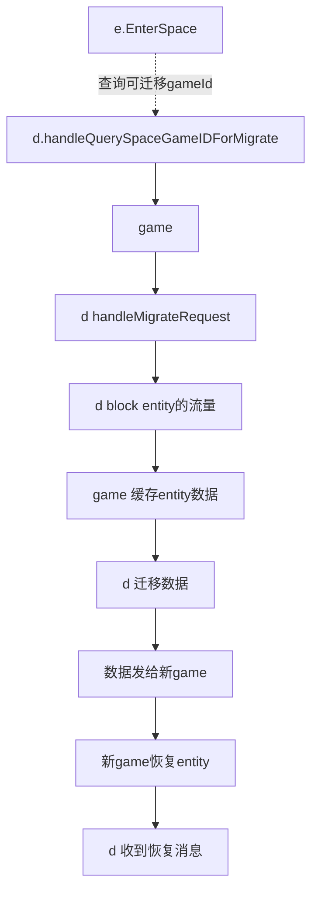
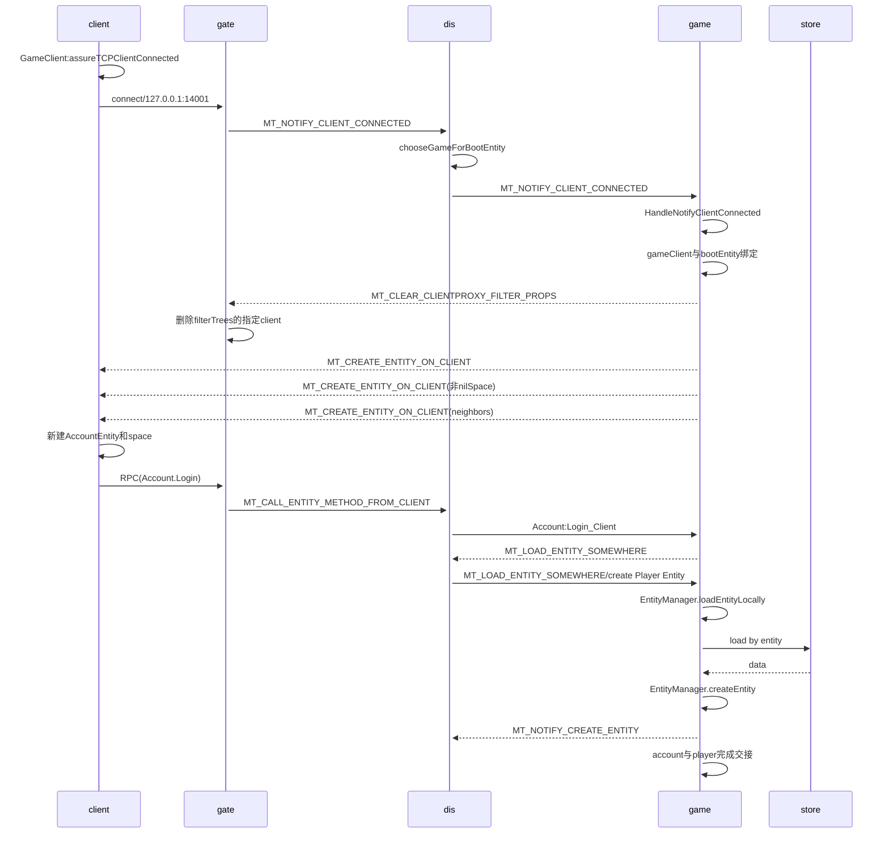
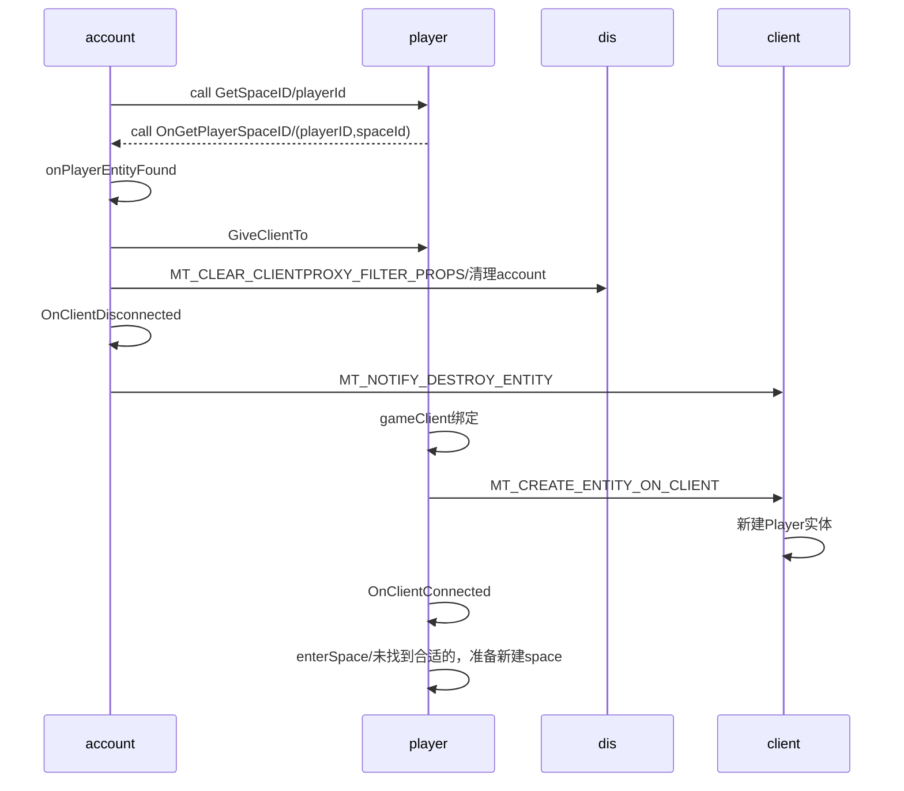
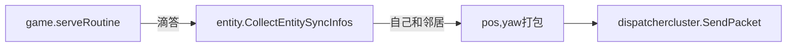

# entity图解
>实体包含了id,spaceId,属性Attr map
>dispatcher相当于路由表，查询entity或者actor，向dispatcher问询。
>因此，进一步扁平化，可以认为gate,login，lobby都是game,通过dispatcher互相通信。服务器之间的跳转，简化为场景切换的概念。
>dispatcher之间通过raft算法实现一致性，这样无论连接哪个dispatcher，都能查到entity位于哪个game


## 1 场景跳转 enterSpace

>e为entity缩写
>d为dispatcher缩写
>entity在不同场景处理不同的业务逻辑

### 1.1 指定空间的跳转
>这种方式常用于指定地图，或者指定房间，比如好友对战或者匹配

### 1.2 跳转随机的一个新空间
>这种方式常用于加载一个新空间，或者不需要指定空间的方式

`goworld.LoadEntityAnywhere("Player", playerID)`

### 1.3 unitydemo演示登录过程
>unity demo,client连接gate，调用login方法，成功后生成player
>其中account是根Entity，默认位于NilSpace,plyer新建后要进入nilSpace，并把account的gameClient连接交接给player，然后player进入MySpace,就是逻辑空间。

#### 1.3.1  account的登录


#### 1.3.2 account 与plyaer的交接




## 2 概念

### 2.1 原始概念
* DispatcherClient：与dispatch连接的客户端，比如game与dispatch连接的功能，未来考虑拆分为ConnServerComponet

### 2.2 原始概念解析

* game启动一个http服务，game主动与dispatcher通信建立连接，自己不需要启动tcp端口，此时的game更像一个client
* dispatch启动http和tcp服务，tcp供game和gate连接
* gate提供tcp，udp供client连接，并通过tcp主动连接dispatch
因此先启动dispatch，这是连接的核心节点，再启动game，game连接dispatch，最后启动gate，gate连接dispatch，并提供服务给gate


## 3 问题

### 3 .1 如何属性同步?
>分为单项同步和双向同步，属性同步的特点是，可以丢弃过时的消息，只获得最新的。

#### 3.1.1 属性如何双向同步?
只有位置和旋转信息需要双向同步，属性变更属于服务端向客户端下发的单向同步
syncInfoFlag属性同步标志，分为
* sifSyncOwnClient：1我自己，不考虑aoi
* sifSyncNeighborClients：2周变玩家，考虑aoi，我的属性要不要告诉周边玩家

双向同步，比如坐标旋转等，由服务端通知客户端

#####  server->client
game的位置消息打包，选好指定的dispatcher连接发送，dispatch再指定gate发送，gate与client连接


#####  client->server

game连接dispatch后，实时收到推过来的信息
```
case proto.MT_SYNC_POSITION_YAW_FROM_CLIENT:
				gs.HandleSyncPositionYawFromClient(pkt)
```
#### 3.1.2 单项同步属性?
server->client

每次server更新属性entity.set-->MapAttr.sendAttrChangeToClients()->owner->sendMapAttrChangeToClients->我和邻居->client.sendNotifyMapAttrChange->client.selectDispatcher().SendNotifyMapAttrChangeOnClient->send packet


### 3.2 entity如何call方法传递给client？
entity通知客户端
entity.call->指定entityId的方法

entity.callClient->呼叫自己的客户端

entity.CallAllClients->呼叫自己和邻居

### 3.3 client如何call方法传递给entity？

game.loop->packetQueue->MT_CALL_ENTITY_METHOD_FROM_CLIENT->EntityManager.OnCall->找到entity->

根据方法名区分是client还是其他服务的调用->解析入参->反射调用


### 3.4 space如何划分房间，什么是spaceKind？
>1Space 类型代表一个游戏服务器中的一个场景。一个场景中可以包含多个Entity。Space和其中的Entity都存在于一个game进程中。 Entity可以通过调用EnterSpace函数来切换Space。如果EnterSpace调用所指定的Space在其他game进程上，Entity将被迁移到对应的game进程并添加到Space中。
>2Space继承自Entity，是Entity的逻辑根节点，Space存储了本空间的所有Entity

每个game进程有个默认NilSpace。

Entity之间通信，首先查找本空间是否存在，存在，直接进程内部通信；如果不存在，则要通知给dispatcher，由dispatcher找到entity属于哪个space。


### 3.5 service的作用？
> Service是一种全局唯一的特殊的Entity对象,与space不一样，其内部只包含关心的entity

这个server其实有点类似ecs里面的system，负责关心的entity的业务逻辑，而entity只包含状态，不包含业务。server是不能持久化的entity。

game进程负责加载和创建service，service与业务相关，与space无关。开发者不能新建service实例。
shard决定了service创建了多少实例。如果是计划设计为system，建议生成一个实例，并且，只处理行为，不处理状态。


#### 3.6 如何处理witness事件？
即会被neighbor看到时，属性要同步给neighbor

#### 3.7 game如何找到合适的dispatcher？
计算entityId的int值，除以dispatcher总数取余，获得dispatcher序号，一个game会连接所有的dispatcher，然后平均分配dispatcher。

也就说说并没有根据dispatcher真实的负载去选择，dispatcher就是一个简单的proxy代理。

```
func SelectByEntityID(entityid common.EntityID) *dispatcherclient.DispatcherClient {
	idx := hashEntityID(entityid) % dispatcherNum
	return dispatcherConns[idx].GetDispatcherClientForSend()
}
```

#### 3.8 space如何新建？

跟entity的新建方式一致，通过反射生成，在装箱为Entity,随时可以拆箱为Space
```
entityInstance = reflect.New(entityTypeDesc.entityType)
	entity = reflect.Indirect(entityInstance).FieldByName("Entity").Addr().Interface().(*Entity)
	entity.init(typeName, entityID, entityInstance)
	entity.Space = nilSpace
```
##### 3.8.1 首次新建：默认创建nilSpace。
game.Run->entity.CreateNilSpace(gameid)->spaceID := GetNilSpaceID(gameid),对于一个固定的gameId，生成固定的spaceId。

##### 3.8.2 restore模式：
读取缓存dat文件，然后

```
entity.RestoreFreezedEntities(&freezeEntity)
//解析每个entity信息
restoreEntity(eid, info, true)
//首先恢复nil space类型entity
// step 1: restore the nil space
	restoreEntities(func(typeName string, spaceKind int64) bool {
		return typeName == _SPACE_ENTITY_TYPE && spaceKind == 0
	})
//然后恢复其他类型space
restoreEntities(func(typeName string, spaceKind int64) bool {
		return typeName == _SPACE_ENTITY_TYPE && spaceKind != 0
})
//最后恢复其他entity
// step  3: restore all other entity
restoreEntities(func(typeName string, spaceKind int64) bool {
		return typeName != _SPACE_ENTITY_TYPE
})
在这一步给非space分配gameClient，而service类型不需要持久化。       
//在遍历的过程总，entity进入space
space := spaceManager.getSpace(mdata.SpaceID)
	if space != nil {
		space.enter(entity, mdata.Pos, isRestore)
	}
```
EntityManager.restoreEntity:
* space类型：执行Space.OnRestored,存入spaceManager,app进程只能有一个space
* entity类型：执行对应实体.OnRestored


#### 3.9 entity如何定时存盘？

> entity新建时启动定时存盘

```
EntityManager.createEntity{
    if isPersistent { // startup the periodical timer for saving e
		entity.setupSaveTimer()
	}
}
```

#### 3.10 entity如何主动存盘？
Entity.save()

#### 3.11 game如何freeze并restore？

>与entity定时存入storage，比如mongo不同，restore是整个game的entity写入本地文件，恢复时再读取。

```

game.restoreFreezedEntities
//文件名
return fmt.Sprintf("game%d_freezed.dat", gameid)

```