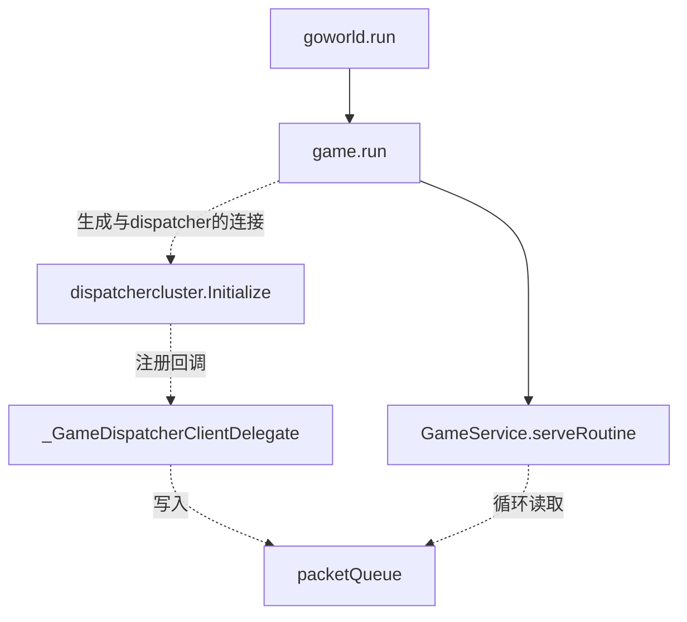
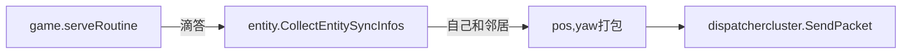

# entity图解
>实体包含了id,spaceId,属性Attr map
>dispatcher相当于路由表，查询entity或者actor，向dispatcher问询。
>因此，进一步扁平化，可以认为gate,login，lobby都是game,通过dispatcher互相通信。服务器之间的跳转，简化为场景切换的概念。
>dispatcher之间通过raft算法实现一致性，这样无论连接哪个dispatcher，都能查到entity位于哪个game


## 1 场景跳转 enterSpace

>e为entity缩写
>d为dispatcher缩写

```mermaid
graph LR
    a[e.EnterSpace]-.查询可迁移gameId.->b[d.handleQuerySpaceGameIDForMigrate]
    b-->c[game]
    c-->d[d handleMigrateRequest]
    d-->e[d block entity的流量]
    e-->f[game 缓存entity数据]
    f-->g[d 迁移数据]
    g-->h[数据发给新game]
    h-->i[新game恢复entity]
    i-->j[d 收到恢复消息]
```




## 2 概念

### 2.1 原始概念
* DispatcherClient：与dispatch连接的客户端，比如game与dispatch连接的功能，未来考虑拆分为ConnServerComponet

### 2.2 原始概念解析

* game启动一个http服务，game主动与dispatcher通信建立连接，自己不需要启动tcp端口，此时的game更像一个client
* dispatch启动http和tcp服务，tcp供game和gate连接
* gate提供tcp，udp供client连接，并通过tcp主动连接dispatch
因此先启动dispatch，这是连接的核心节点，再启动game，game连接dispatch，最后启动gate，gate连接dispatch，并提供服务给gate


## 3 问题

### 3.0 game是怎么选择dispatcher节点的？

### 3 .1 如何属性同步?
>分为单项同步和双向同步，属性同步的特点是，可以丢弃过时的消息，只获得最新的。

#### 3.1.1 属性如何双向同步?
只有位置和旋转信息需要双向同步，属性变更属于服务端向客户端下发的单向同步
syncInfoFlag属性同步标志，分为
* sifSyncOwnClient：1我自己，不考虑aoi
* sifSyncNeighborClients：2周变玩家，考虑aoi，我的属性要不要告诉周边玩家

双向同步，比如坐标旋转等，由服务端通知客户端

#####  server->client
game的位置消息打包，选好指定的dispatcher连接发送，dispatch再指定gate发送，gate与client连接


#####  client->server

game连接dispatch后，实时收到推过来的信息
```
case proto.MT_SYNC_POSITION_YAW_FROM_CLIENT:
				gs.HandleSyncPositionYawFromClient(pkt)
```
#### 3.1.2 单项同步属性?
server->client

每次server更新属性entity.set-->MapAttr.sendAttrChangeToClients()->owner->sendMapAttrChangeToClients->我和邻居->client.sendNotifyMapAttrChange->client.selectDispatcher().SendNotifyMapAttrChangeOnClient->send packet


### 3.2 entity如何call方法传递给client？
entity通知客户端
entity.call->指定entityId的方法

entity.callClient->呼叫自己的客户端

entity.CallAllClients->呼叫自己和邻居

### 3.3 client如何call方法传递给entity？

game.loop->packetQueue->MT_CALL_ENTITY_METHOD_FROM_CLIENT->EntityManager.OnCall->找到entity->

根据方法名区分是client还是其他服务的调用->解析入参->反射调用


### 3.4 space如何划分房间？
### 3.5  service的作用？


#### 3.6 如何处理witness事件？
即会被neighbor看到时，属性要同步给neighbor
## 未来计划

###  新概念
* NetServerTcpComponent: 可以收发消息的组件，提供tcp,kcp,websocket,http等
* NetServerKcpComponent: 可以收发服务端节点消息的组件
* NetServerWssComponent: 可以收发服务端节点消息的组件
* NetServerHttpComponent:  可以收发服务端节点消息的组件
* NetConnTcpComponent:  可以连接服务端节点的组件，只提供http服务，供查询消息
* NetConnHttpComponent:  可以连接http的节点
