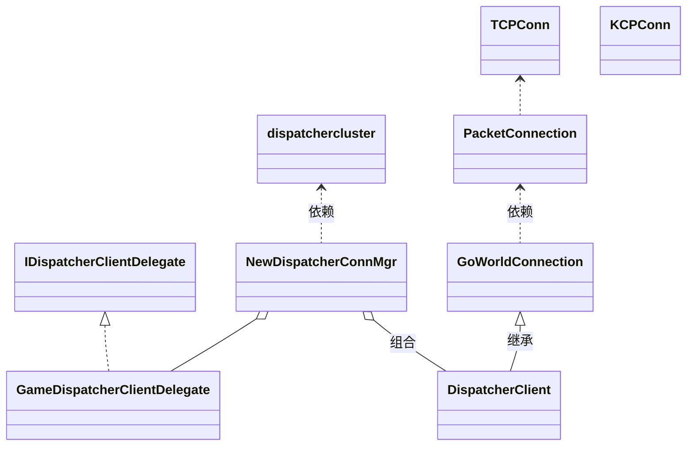

# 4.4 收发包频率和逻辑帧率

## 发包频率

参考守望先锋1秒60次，王者荣耀1秒15次，状态同步跟帧同步都有发包频率的设计。

* 状态同步：需要定时发送坐标和旋转信息，这些信息需要设计发包频率；而属性信息则变更就发送，受逻辑帧率影响
* 帧同步：除了同步坐标和旋转信息，还要同步每一逻辑帧的指令包，这时候发包频率=逻辑频率

### 状态同步
> goworld目前看是适用于mmorpg游戏，这类游戏基本基于状态同步。

坐标旋转默认100ms同步一次，就是1秒10次。

逻辑帧率是整个世界多久处理一次发包逻辑，发包会把真个帧未发送的数据全部发送。

而rpc则是实时发送。

### 问题

#### 1. 一个game一个进程，大世界表示一个地图，多房间游戏呢？

考虑借助space拆解，一个space为一个room，一个进程可开启多个space。那loop循环呢，是space共享一个loop，还是一个进程保持一个loop呢。

#### 2. game发包的频率控制，怎么实现？
>game与dispatcher通信是tcp,收频率，取决与dispatcher的发送频率，发包取决与自己的业务逻辑

game端核心是dispatcherConnMgr,通过tcp连接dispatcher,

* DispatcherConnMgr.DispatcherClient:返回可用的已连接dispatcher的客户端，提供clint->server
* DispatcherConnMgr.serveDispatcherClient：循环接受packet,s->c,
* DispatcherConnMgr.connectDispatchClient:生成tcp连接实例conn，交给DispatcherClient,DispatcherClient封装conn为GoWorldConnection
* GoWorldConnection又把这个conn给了packetConn封装,因此使用packet的协议来拆包，packet是使用messagePacket封装的自定义格式，当然可以变更为protobuf。不管是使用什么协议，暴露给业务层的都是GoWorldConnection

类图：

发包包含实时同步和rpc方法，怎么实现包的顺序化，定时化。
发包的关键就是对DispatcherClient的调用，DispatcherConnMgr管理DispatcherClient的实例。
DispatcherClient继承自GoWorldConnection，这个是通用的连接实例，是对tcp，kcp的抽象。

收报流程：收到就处理

发包流程：

* 属性变更：直接拿到dispatcherClient发包，对实时性要求高。
* 位置坐标：周期行同步，100ms执行一次
* rpc行为同步：5ms

3. game进程如何做指标监控