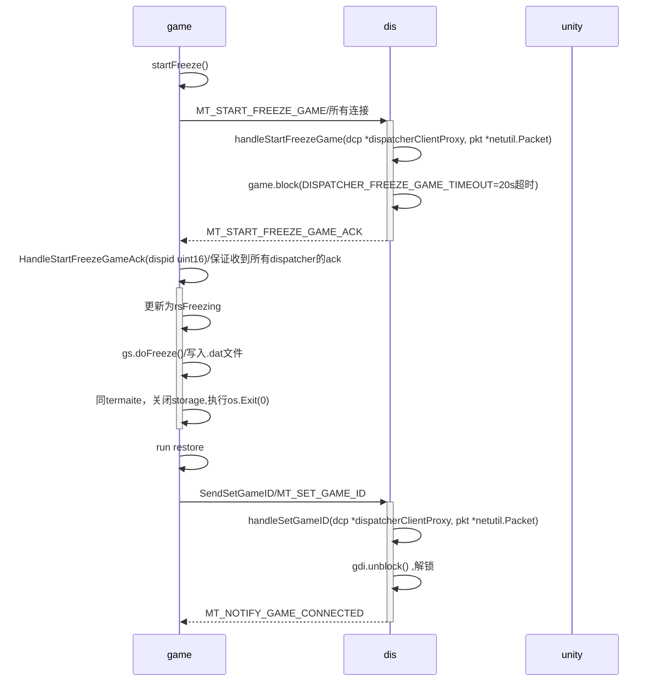

# game服务器的重启与恢复

>这个需求，dispatcher起到了最大作用，它可以把gate推到game的包缓存起来，等game重启成功再推过来。

终端进程信号命令

* syscall.SIGTERM 	结束程序(可以被捕获、阻塞或忽略)
* syscall.SIGINT 用户发送INTR字符(Ctrl+C)触发
* syscall.SIGHUP 终端控制进程结束(终端连接断开)
* syscall.SIGQUIT 用户发送QUIT字符(Ctrl+/)触发
* syscall.SIGKILL 无条件结束程序(不能被捕获、阻塞或忽略)

区分两种情况：

1. 主动终端，比如控制台，类型为Terminating
2. 恢复模式，发送reload命令，发送syscall.SIGHUP命令，类型为Freezing

## 1 Terminate模式

1. 子线程`gs.runState.Store(rsTerminating)` 更新runState状态
2. 轮训等待runState从rsTerminating变为rsTerminated
3. gameServer当runState状态变为rsTerminating,执行gs.doTerminate()
4. gs.waitPostsComplete() 执行所有推到主线程的回调函数
5. async.WaitClear 清理所有异步
6. 执行 entity.OnGameTerminating() 通知dispatcher销毁所有的entityDispatchInfos
6.1 通知dis MT_NOTIFY_DESTROY_ENTITY
7. runState更新为rsTerminated
8. 执行waitEntityStorageFinish()，等待storage的后续操作，并关闭连接
9. os.Exit(0)

## 2 Freez模式

1. post推送主线程执行`gameService.startFreeze()`
2. 通知dispatcher冻结game`MT_START_FREEZE_GAME`

## 3 优化

* 1 控制台中断也触发freez
* 2 每次启动都是restore模式
* 3 dispatcher判断game下线过久，自动给kbs发送命令，强制启动一个game服务
* 4 game,dispatcher,gate注册etcd
* 5 基于k8s的服务治理

### 3.1~3.2 强制freeze模式

离线20s以内 DISPATCHER_FREEZE_GAME_TIMEOUT = 20,dispatcher暂时缓存packet,超时就不再缓存了。

启动时配置`-restore=true` 