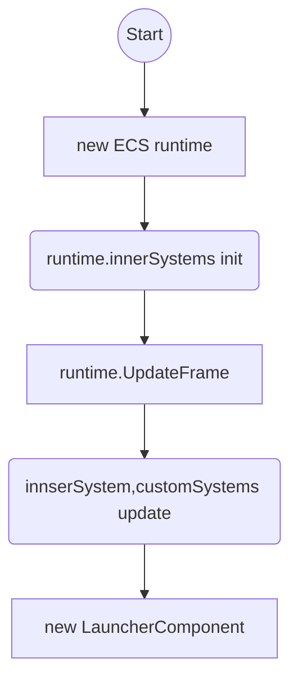

# rockgo

>基于golang的ecs架构的游戏服务器

## 项目架构

ecs构建系统，实现分为

* component：组合模式，包含baseCompont,baseCompont存储根节点，挂载节点，以及world的引用
* object 相当于entity，component挂载之上，并作为节点，形成树形结构，root节点为runtime的entity，runtime可以认为是world
* sysmtem:pure function,分为innerSystems和customeSystems，存储于runtime，由runtime复杂update

* Server可以理解为一个entity，而这个entity就是runtime的root点，挂载了LauncherComponent，如果挂载了gateCompont就是网关了，如果挂载了loginComponent，就是登录模块了

总结一下：

首先创建wolrd，也就是runtime，runtime包含了systems数组，并启动update去更新system，同时runtime包含一个entity为世界的根节点，所有的entity是它的子节点，这个根节点挂载launcherComponent等组件，则这个root即为server，而与用户相关的网络连接，应挂载在用户身上。挂载在root上的连接，只负责维护世界以及分布式等功能。

同时

## 项目启动流程

