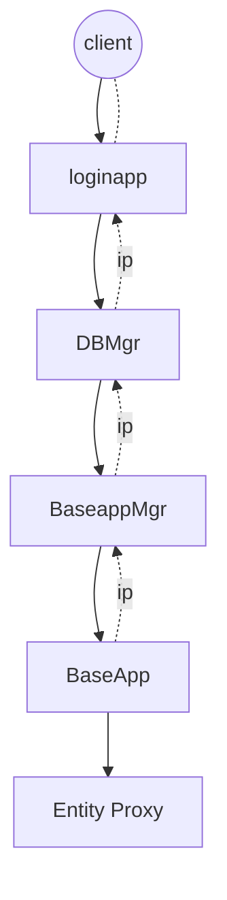
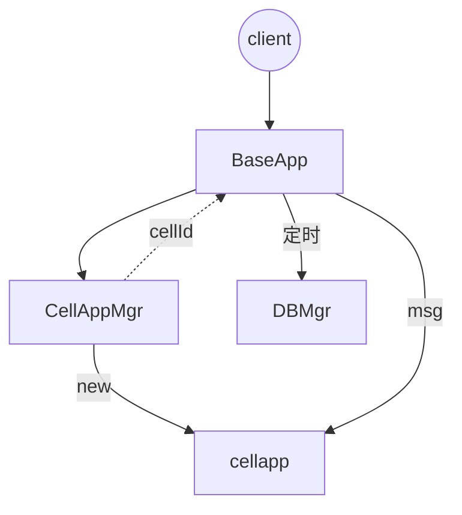

# kbengine阅读笔记

>c++ python开发的基于ecs+actor架构的mmorpg服务器引擎

知识点：

* 命令帧率：帧同步每帧命令的频率，比如守望先锋16ms，相当于62帧。
* 发包频率：可以根据客户端的性能以及网络抖动，动态调整服务端往客户端发包的频率，频率变更，每个包包含的命令帧也要变更了，要保证每个客户端执行命令帧的频率尽量一致。
    - ：一般rpg每秒1-10次即可
    - ： fps和赛车就得10-30次。王者荣耀是15次
* 服务端调度频率：服务端update的频率，恒定值，比如10hz，1秒10次，可适用用大部分arpg等，如果是fps，可能要调整为20或者30，帧率小于命令帧时，要对命令帧合并处理。
* 渲染帧率:一般要大于命令帧率，对命令帧做插值计算，是客户端的渲染频率，比如命令帧为30fps，渲染真可以为60，甚至120，甚至不固定


状态同步：不要求过程一致，只保证结果一致，适用于rpg，fps，赛车等，应用更广，分为dr同步和非dr同步，前者需要推测模拟。平时以固定频率给服务器发指令包，遇到关键帧直接发送指令包，不用等待频率。

结果同步： 回合制等离线数据pk模式。

帧同步：分为帧锁定和乐观帧锁定，大部分都是用第二种，常用于arpg,moba。发送指令，一般客户端预先执行1到2帧，把这些帧写入播放队列，之后才能收到服务端后续指令，存入播放队列，如果队列空了，就本地模拟写入。如果指令过多，远大于本地帧id，就快进播放。如果网速过慢，那本地帧也变快，发送指令变快。如果服务器指令跟本地指令不一致，就合并到服务器指令。

time wrap: 回滚逻辑。客户端领先服务端，不须等待服务器确认执行指令。收到服务指令对照，不一致回退到正确帧再追回当前帧。守望先锋的实现。
     - ：难点是和解。分为可以和解，不可和解。可以的：位移，动画。不可以的：伤害。飞弹可以和解，但是要用延迟派发，为了重用，每个实体拥有唯一id。

snapshot: 逻辑快照。需要借助ecs的实现，ecs本身对数据和逻辑做了拆分。而快照就是状态数据和指令的缓存。

架构：

* loginapp :网关
* baseapp:大厅等位置无关服务，或承担负载与代理角色
* cellapp:room
* baseAppMgr: baseapp的管理监控，一个服务群组一个baseManager
* cellAppMgr: cellapp的管理与监控，一个服务器组一个cellappManager
* space: 空间概念，包含多个cell,常用于mmorpg或者fps
* space本身也是个entity，并且是整个space区域的根节点
* daemon：每台物理机一个，监控进程状态。
* Controller: 相当于system，纯函数，实现具体behavior


## 架构图

## 目录结构

```
+  demos_assets //demo资源目录
    + res //项目配置
        + server //项目xml配置
            - kbengine.xml
    + scripts // py逻辑脚本       

+ kbe //引擎主题
    + res //xml等配置文件
        + scripts //py脚本的公共依赖
        + server //xml配置文件
            - kbengine_defaults.xml:基础配置文件
    + src //c++源码
        + client //客户端sdk源码，包含unity支持的c#代码
        + server //服务端源码，包含7中服务
            -   Makefile: linux等平台的编译配置
            -   .vcxproj：windows平台visual studio的项目文件
        + libs //c++标准库
        + lib  //自己实现的工具库


```
## 启动项目

1. 首次登陆


2 建立连接

## 源码阅读

### 1  loginapp 
>登陆模块，client访问server的入口

