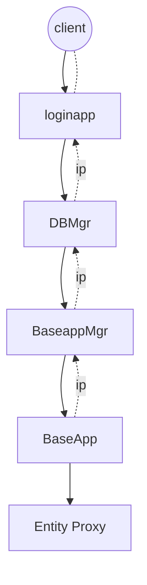
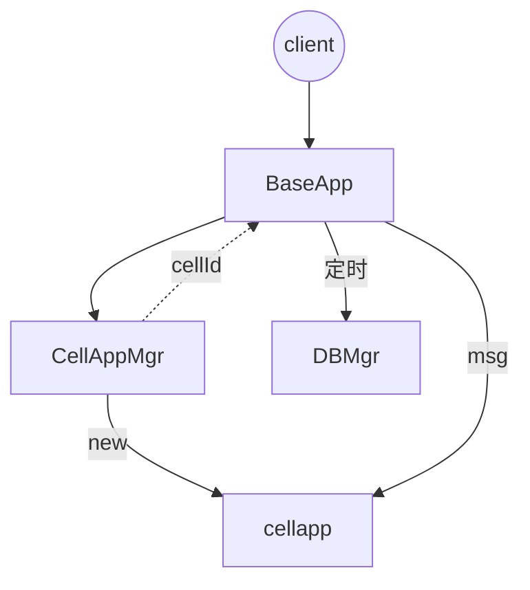

# kbengine阅读笔记

>c++ python开发的基于ecs+actor架构的mmorpg服务器引擎


架构：

* loginapp :网关
* baseapp:大厅等位置无关服务，或承担负载与代理角色
* cellapp:room
* baseAppMgr: baseapp的管理监控，一个服务群组一个baseManager
* cellAppMgr: cellapp的管理与监控，一个服务器组一个cellappManager
* space: 空间概念，包含多个cell,常用于mmorpg或者fps
* space本身也是个entity，并且是整个space区域的根节点
* daemon：每台物理机一个，监控进程状态。
* Controller: 相当于system，纯函数，实现具体behavior


## 架构图

## 目录结构

```
+  demos_assets //demo资源目录
    + res //项目配置
        + server //项目xml配置
            - kbengine.xml
    + scripts // py逻辑脚本       

+ kbe //引擎主题
    + res //xml等配置文件
        + scripts //py脚本的公共依赖
        + server //xml配置文件
            - kbengine_defaults.xml:基础配置文件
    + src //c++源码
        + client //客户端sdk源码，包含unity支持的c#代码
        + server //服务端源码，包含7中服务
            -   Makefile: linux等平台的编译配置
            -   .vcxproj：windows平台visual studio的项目文件
        + libs //c++标准库
        + lib  //自己实现的工具库


```
## 启动项目

1. 首次登陆


2 建立连接

## 源码阅读

### 1  loginapp 
>登陆模块，client访问server的入口

